# 实验四：对象管理

# 软工二班201810414223谢金峰

# 实验目的:

了解Oracle表和视图的概念，学习使用SQL语句Create Table创建表，学习Select语句插入，修改，删除以及查询数据，学习使用SQL语句创建视图，学习部分存储过程和触发器的使用。

# 实验场景:

假设有一个生产某个产品的单位，单位接受网上订单进行产品的销售。通过实验模拟这个单位的部分信息：员工表，部门表，订单表，订单详单表

# 实验内容:

## 录入数据:

要求至少有1万个订单，每个订单至少有4个详单。至少有两个部门，每个部门至少有1个员工，其中只有一个人没有领导，一个领导至少有一个下属，并且它的下属是另一个人的领导（比如A领导B，B领导C）。

## 序列的应用

插入ORDERS和ORDER_DETAILS 两个表的数据时，主键ORDERS.ORDER_ID, ORDER_DETAILS.ID的值必须通过序列SEQ_ORDER_ID和SEQ_ORDER_ID取得，不能手工输入一个数字。

## 触发器的应用:

维护ORDER_DETAILS的数据时（insert,delete,update）要同步更新ORDERS表订单应收货款ORDERS.Trade_Receivable的值。

## 查询数据:

1.查询某个员工的信息
2.递归查询某个员工及其所有下属，子下属员工。
3.查询订单表，并且包括订单的订单应收货款: Trade_Receivable= sum(订单详单表.ProductNum*订单详单表.ProductPrice)- Discount。
4.查询订单详表，要求显示订单的客户名称和客户电话，产品类型用汉字描述。
5.查询出所有空订单，即没有订单详单的订单。
6.查询部门表，同时显示部门的负责人姓名。
7.查询部门表，统计每个部门的销售总金额。

# 表结构:

* 部门表DEPARTMENTS,表空间：USERS
* 产品表PRODUCTS,表空间：USERS
* 员工表EMPLOYEES,表空间：USERS
* 订单表ORDERS, 表空间：分区表：USERS,USERS02
* 订单详单表ORDER_DETAILS, 表空间：分区表：USERS,USERS02，分区参照ORDERS表。
* 数据关系图如下

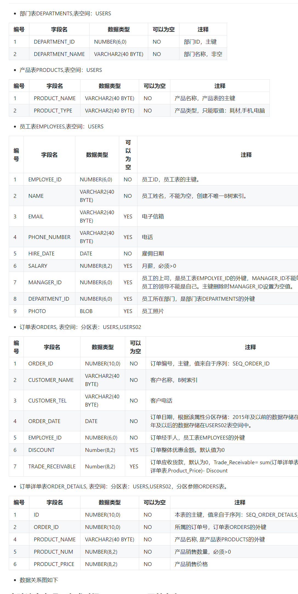

# 删除表和序列:

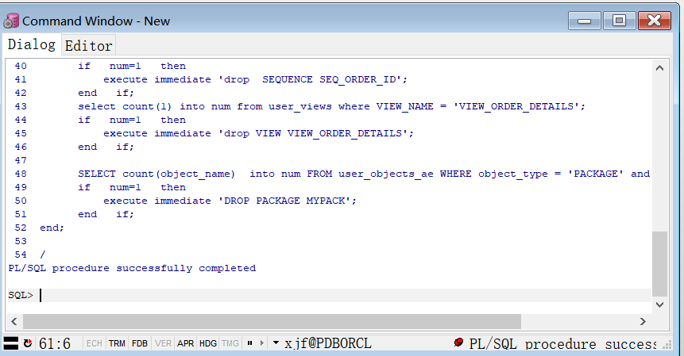

# 其他操作:

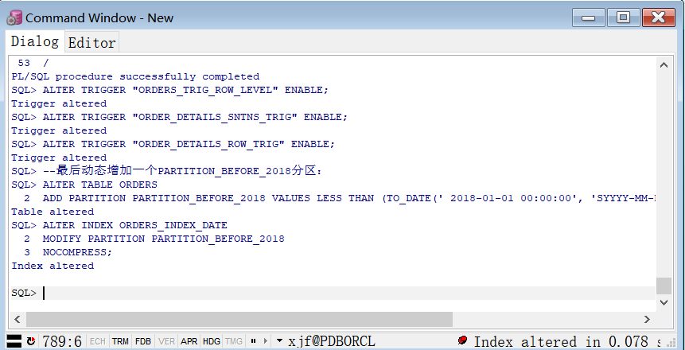

# 测试:

* 1 select * from ORDERS where  order_id=1;

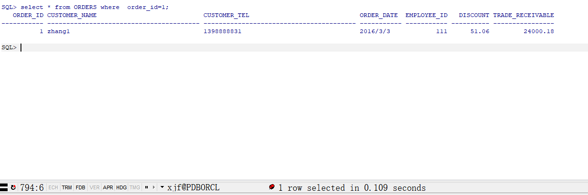

* 2 select * from ORDER_DETAILS where  order_id=1;

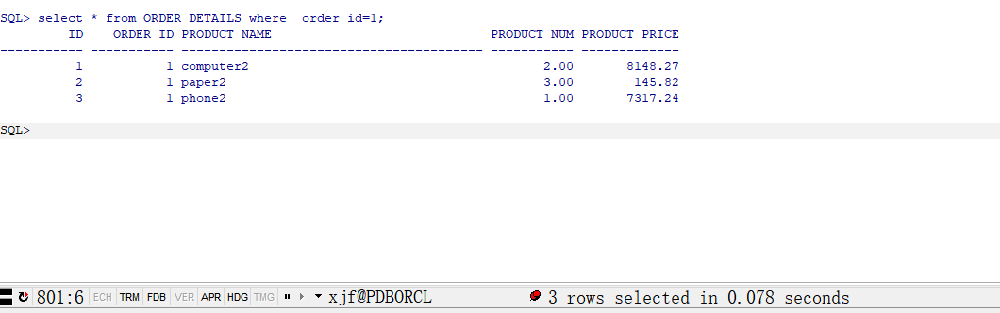

* 3 select * from VIEW_ORDER_DETAILS where order_id=1;

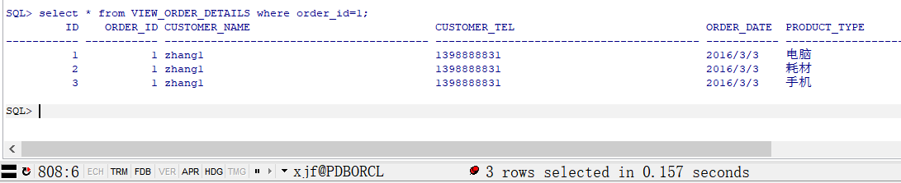

* 4 递归查询某个员工及其所有下属，子下属员工

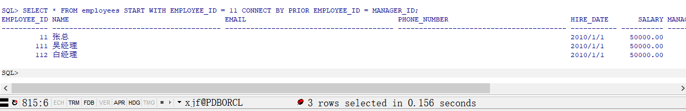

* 5 查询分区表情况:
  
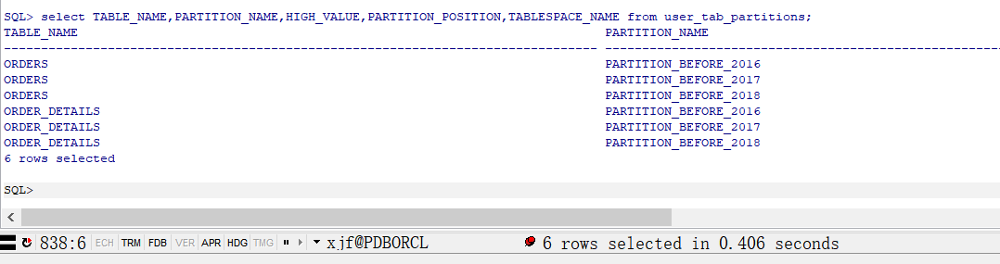

* 6 查询分区索引情况：

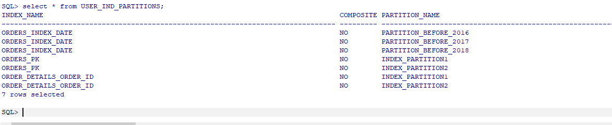

* 7 查询一个分区中的数据

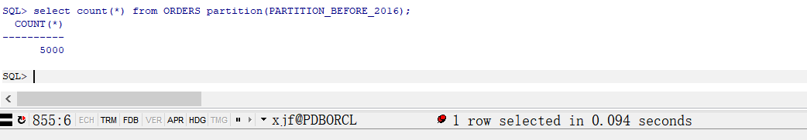

* 8 select count(*) from ORDERS partition(PARTITION_BEFORE_2017);

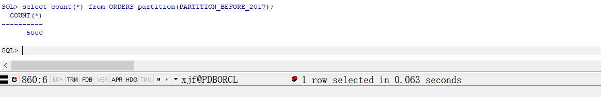

* 9 收集表的统计信息dbms_stats.gather_table_stats

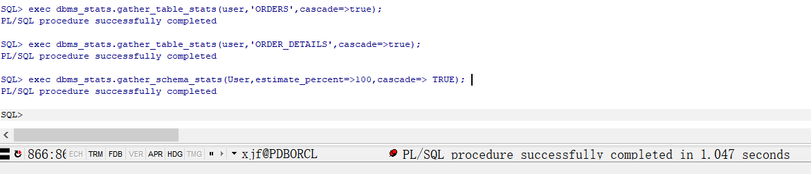

* 10 select table_name,tablespace_name,num_rows from user_tables where table_name='ORDERS';

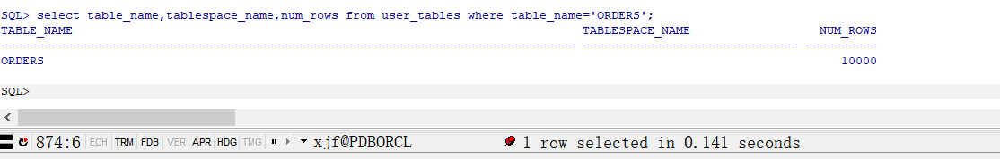

* 11 select table_name,tablespace_name,num_rows from user_tables where table_name='ORDER_DETAILS';

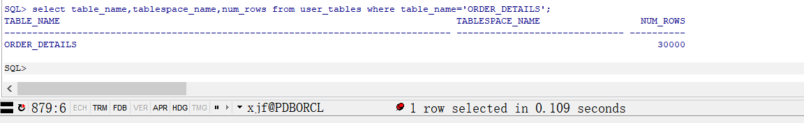

* 12 select * from orders where order_id=1300;

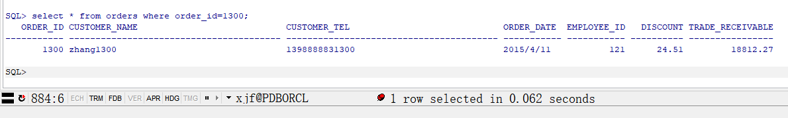

* 13 select * from ORDER_DETAILS where order_id=1300;

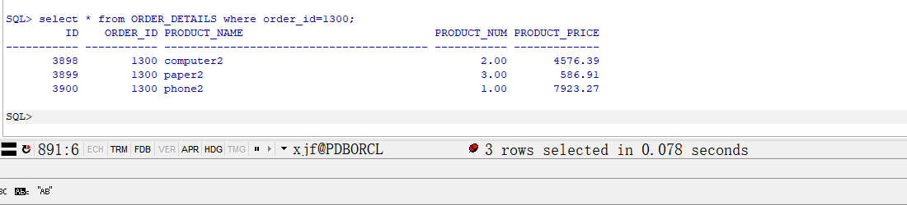

* 14 select * from orders where order_date<to_date('2016-01-01','yyyy-mm-dd');

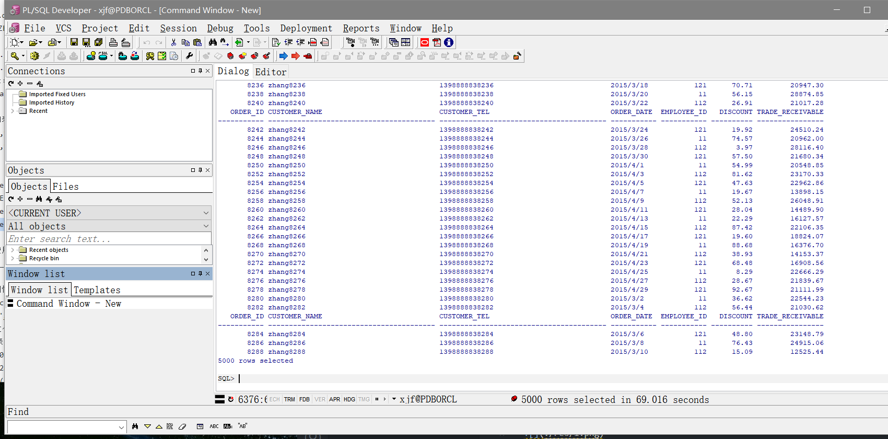

* 15 查看数据文件的使用情况

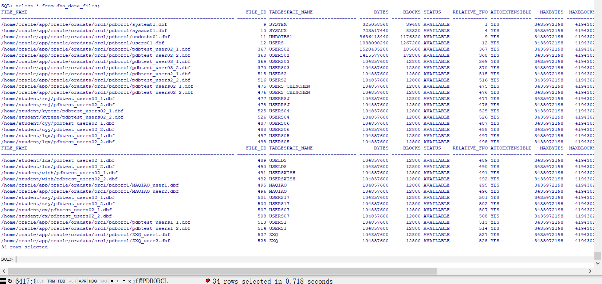

# 实验总结:
    通过本次实验，我了解Oracle表和视图的概念，学习使用SQL语句Create Table创建表，学习Select语句插入，修改，删除以及查询数据，学习使用SQL语句创建视图，学习部分存储过程和触发器的使用。
  